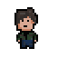

<h1 align="center">
<strong>
Judgement Day
</strong>
</h1>

# SUBMISSION

## Deployment

This project is deployed and can be accessed at [https://stephendawsondev.github.io/j-day/](https://stephendawsondev.github.io/j-day/).

## Criteria

In this section, we will briefly discuss how our team addressed the applicable criteria:

- ✨ Project is 100% Front End
- ✨ Project must be retro inspired, inspired by actual retro game
- ✨ Project has neon and 80s music
- ✨ Basic Readme.md in place
- ✨ Use Frameworks such as _Kaboom.js, phaser.js, three.js, babylon.js, pixi.js_

# ABOUT SUBMISSION

## Intro

A retro game based on the Terminator franchise. A top down shooter game with interactive enemies, difficulty progression, arcade style music and game sounds. Using solely the kaboom.js framework to implement various functions and colliding objects that combines to give the user a unique game play as well as nostalgic experience.

## Goal

The goal of this project is to produce a retro emulator game following the criteria set out by the hackathon facilitators and incorporating the hard work, skills and abilities of each team member while enjoying the process of learning to develop new and unique software.

- ➡️ To organise a group of strangers with varying abilities to join together to create an emulator type retro game from scratch using a new language and modern techniques.
- ➡️ The game will be disigned using a JavaScript frame work called Kaboom. It will be new to most of the team but will be a benificial learning curve for all involved.
- ➡️ The game will be aimed toward people born in or brought up in the 70s and 80s who fondly remember playing old emulator games on arcade machines in seaside amusement parks and any fans of the terminator franchise who grew up following the story behind John and Sarah Connor in their timeless battle against SkyNet.

## User Stories

* As a user, I want to be able to see the overall theme of the game from the welcome page.
    * The welcome page captures the over all theme and criteria, Retro style background, retro style neon flashing font.
* As a user, I want to be able to easily access the instructions on how to play the game.
    * The instructions are clear and concise and the background is inline with the theme of the game.
* As a user, I want to be able to toggle the music/sound incase I find the volume to be too low or too high.
    * A toggle button was added to the welcome page for easy access to volume control.
* As a user, I want to be able to see the details of the game such as my score and lives.
    *  The player is given clear information on the top of the screen it portrays the players points and players lives.
* As a user, I want to be able to easily move around the scene and feel there is a progression in difficulty.
    * 
* As a user, I want to be able to feel a sense of achievement such as high score or end level boss fights.
    * Due to time constraints the team found it would be easier to achieve a high score rather than multiple levels and boss fights. This is a feature that could be implemented in future iterations.
* As a user, I want to be able to pause and resume or quit the game if i so wish.
    * To pause the game was too difficult to implement in the given time. 

## Design

The criteria suggested an old school emulator game with retro neon style appearance. 

### Visual Design 
- Pixel Art Graphics: Emulate the retro arcade feel with pixel art graphics, using a limited color palette to mimic the visual style of old-school games.

### Level Design 
- Arcade Amusement Environment: An urban environment that depicts an amuesment arcade park to provide even more nostalgia.

### Audio Design 
- Retro Sound Effects: Use sound effects inspired by classic arcade games, such as pew-pew laser sounds and explosive booms and the famous Wilhelm death scream.

### Color Design 
- Retro Neon Color: Incorporate many dark colors to entrench the apocolyptic scenario but apply neon colors such as yellow and bright purple to align with the criteria and arcade theme.

### Gameplay Design 
- Top down shooter: Design the game as a view of top down shooter, where players control a resistance fighter from above battling against waves of terminator enemies.

## Typography

- The font chosen for the welcome page was picked from Kaboom.js as it has built in font apl386 and it has a very emulator appearance.
- The font chosen for the instructions page was picked to be a yellow "Comic-Sans MS" to be clear and stand out to the player. 

## Imagery

* Team Logo 
  * Logo - Designed using https://www.canva.com 

  

* Background Images
  * Welcome page - sourced from https://www.pxfuel.com/en/query?q=terminator+for+android
  

  * Instructions Page - sourced from https://www.radiotimes.com/technology/gaming/terminator-survival-project-release-date/

    

  * Game Over page - sourced from https://news.sky.com/story/terminator-and-other-sci-fi-films-blamed-for-publics-concerns-about-ai-12895427
  
    

* Pixel Art
  * The pixel art was designed using https://www.pixilart.com/draw 

      
      
      

  * The arcades and pinball machine was designed using a picture template from a google search

      
      
      
      

  * The carpet is similar to old style arcade amusement park carpets.

      

## Audio
  - The music was designed by Kyle Clow (Terminal8tors team member) as well as game sounds and other sound effects.
      * Music - created using the program https://www.ableton.com/en/
             
      * Wilhelm scream - sourced from https://bigsoundbank.com/

        

      * Scream when terminator is hit sound effect - sourced from https://www.youtube.com/watch?v=AZTFdO4a_ew&ab_channel=MatthewEhlerspresents
      * I'll be back sound effect - sourced from https://www.youtube.com/watch?v=B1ULWx0eflM&ab_channel=ShortVidClips%2F%2FSVC
      * Hasta la vista sound effect - sourced from https://www.youtube.com/watch?v=EIs4tQHEdxc&ab_channel=IfIamTheBass%3F

      * Gameover sound effect - sourced from https://opengameart.org/
      
      * Other sound effects - created using https://www.bfxr.net/

## Controls

On starting the game the player will use W, S, A and D to move the character around the screen all while avoiding enemies and enemy fire. Spacebar fires a projectile in the direction the player is facing.

| Button | Action      |
| ------ | ----------- |
| W      | Move Up     |
| A      | Move Left   |
| S      | Move Down   |
| D      | Move Right  |
| Space  | Fire        |
| M      | Toggle Music|

## Wireframes

www.figma.com - Figma is a cloud-based design and prototyping tool that is widely used for creating user interfaces (UI) and user experience (UX) designs. 

## Tech

* HTML5
* CSS3
* JavaScript
* Kaboom.js

## Programs Used

### Version Control

* [Github](https://github.com/) used to host repository.
* [Github pages](https://pages.github.com/) used to deploy the website.

### Code Editors

* [Codeanywhere](https://app.codeanywhere.com/) used to develop project and organise version control.
* [Gitpod](https://gitpod.io/) used to develop project and organise version control.
* [VScode](https://code.visualstudio.com/) free and open-source code editor and customizable tool for writing code.

### Libraries

* [Pixelart](https://www.pixelart.com/) used to design sprites.
* [StackOverflow](https://stackoverflow.com/) used to problem solve and deal with queries.
* [ChatGPT](https://chat.openai.com/) used to generate placeholder text and to verify code.

### Communications

* [Slack](https://slack.com/intl/en-ie/) a widely-used cloud-based communication and collaboration platform designed to facilitate efficient communication and teamwork within organizations, teams, and communities.

## Credits

- **Thank you to all the team members for the hard work and cooperation.**

  - **Stephen Dawson** - [GitHub](https://github.com/stephendawsondev), [LinkedIn](https://www.linkedin.com/in/sdstephendawson/), [URL](http://www.stephendawson.ie)
  Scrum Master/ Frontend / Documentation
  - **Kyle Clow** - [GitHub](https://github.com/KTC96), [LinkedIn](https://www.linkedin.com/in/kyle-clow-43471b130/)
  Design/ Frontend / Documentation
  - **Karolina Cisek-Ndlovu** - [GitHub](https://github.com/Koko-66), [LinkedIn](https://www.linkedin.com/in/k-c-n/)
  Design/ Frontend / Documentation
  - **Adam Gilroy** - [GitHub](https://github.com/adamgilroy22), [LinkedIn](https://www.linkedin.com/in/adamgilroy22/)
   Design/ Frontend / Documentation
  - **Mark Young** - [GitHub](https://github.com/Markyjay), [LinkedIn](https://www.linkedin.com/in/mark-young-4a90ab15/)
   Design/ Frontend / Documentation
  - **Sasan Tazayoni** - [GitHub](https://github.com/SasanTazayoni), [LinkedIn](https://www.linkedin.com/in/sasan-tazayoni/)
   Design/ Frontend / Documentation
  - **Nazek Altayeb** - [GitHub](https://github.com/Nazek-Altayeb), [LinkedIn](https://www.linkedin.com/in/nazek-a-altayeb/)
   Design/ Frontend / Documentation
  - **Mohamed Ayman** - [GitHub](https://github.com/moabdelbasset), [LinkedIn](https://www.linkedin.com/in/mohamed-ayman-b29b5b66/)
   Design/ Frontend / Documentation